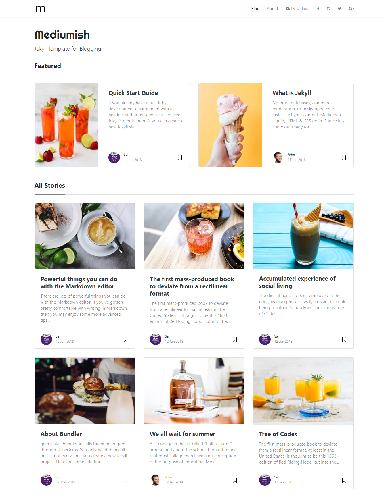

# Mediumish - Jekyll Theme

[Live Demo](https://iamtamodip.github.io/blog/) &nbsp; | &nbsp; [Download](https://github.com/wowthemesnet/mediumish-theme-jekyll/archive/master.zip) &nbsp; | &nbsp; [Documentation](https://bootstrapstarter.com/template-mediumish-bootstrap-jekyll/)

### Contribute

1. [Fork the repo](https://github.com/iamtamodip/blog).
2. Clone a copy of your fork on your local
3. Create a branch off of master and give it a meaningful name (e.g. my-new-mediumish-feature).
4. Make necessary changes, commit, push and open a pull request on GitHub.

Thank you!
